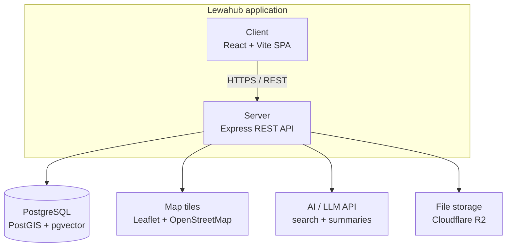

# 🎓 LewaHub

**Find the right verified school**

## Run the anonymous review page

From the project root:

```bash
npm install
npm start
```

Open `http://localhost:5173` in your browser. To create a production build, run `npm run build`.

A school discovery platform for Cameroon — covering Primary/Nursery, Secondary, and University
schools, with location-based search, verified student ratings, and an admin panel for managing
the catalog.


---

## 📖 Overview

LewaHub helps parents and students in Cameroon discover and evaluate schools with confidence.
Institutions are searchable by region, level, and program, locatable on a map, and rated by students
who have verified their enrollment , so ratings reflect real experience, not anonymous reviews.

The platform has two sides:

- **Public site** : fully anonymous browsing, no account required
- **Admin panel** : staff-only, for managing the institution catalog

---

## ✨ Features

### Public Site

- 🔍 **Search & filter** : Region, Level (Nursery/Primary/Secondary/University), Language of
  instruction, Ownership, Boarding/Day, Programs, Minimum rating
- 🗺️ **Interactive map** : real institution locations, "find near me" support
- 🏫 **Institution profiles** : description, programs, verified rating, location, contact info,
  related institutions
- ⭐ **Verified ratings** : only students who confirm enrollment (via receipt, school ID, or
  matricule) can rate a school; only the aggregate average and count are shown publicly
- 🌍 **Bilingual** : full French / English toggle across the entire site
- 📱 **Fully responsive** : mobile-first design, works on any screen size

### Admin Panel

- 🔐 Secure staff login
- 📊 Dashboard with live catalog stats
- 🏫 Full CRUD on schools : add, edit, delete, all reflected instantly on the public site

---

## 🗂️ School Category Model

LewaHub uses exactly **3 categories**, matching the database schema:

| Category value   | Displayed as      | Notes                                                                                   |
| ---------------- | ----------------- | --------------------------------------------------------------------------------------- |
| `PrimaryNursery` | Primary / Nursery | Nursery and primary schools combined                                                    |
| `Secondary`      | Secondary         | May have `offersHighSchool: true` for schools that also run A-Level (Lower/Upper Sixth) |
| `University`     | University        | Includes colleges and technical institutes                                              |

There is no separate "High School" category — a secondary school that offers both O-Level and
A-Level is a single `Secondary` record with `offersHighSchool: true`.

---

## 🛠️ Tech Stack

| Layer    | Technology                                              |
| -------- | ------------------------------------------------------- |
| Frontend | React · Vite · TypeScript · Tailwind CSS · React Router |
| Maps     | Leaflet + OpenStreetMap                                 |
| Backend  | Node.js · Express                                       |
| Database | PostgreSQL + PostGIS                                    |
| ORM      | Prisma                                                  |
| Auth     | JWT + bcrypt                                            |

## Architecture

Lewahub is a **layered monolith** : one client-server application, not microservices. This was a deliberate choice; the team is small, the budget is limited, and the core data (schools, subschools, programs, evaluations) is tightly relational, so a single backend serving one database avoids the network overhead and operational cost that splitting into independent services would add without a corresponding benefit at this scale.



**Layers inside the backend** (routes → services → data access) keep responsibilities separated even though everything deploys as one process:

- **Routes** : Express route handlers, one per resource (`/api/schools`, `/api/evaluations`, `/api/auth`, etc.)
- **Services** : business logic (approval workflows, evaluation recording, AI-content review gating)
- **Data access** : Prisma ORM against PostgreSQL

---

## 📂 Project Structure

```

LewaHub/
├── Frontend/
│ └── src/
│ ├── components/ # shared layout — Navbar, Footer
│ ├── features/
│ │ ├── home/
│ │ ├── search/
│ │ ├── school-details/
│ │ ├── contact/
│ │ ├── about/
│ │ └── admin/
│ ├── lib/ # shared API client
│ └── App.tsx # route definitions
│
└── Backend/
├── src/
│ ├── modules/
│ │ ├── schools/
│ │ ├── programs/
│ │ ├── geolocation/
│ │ ├── search/
│ │ └── admin/
│ ├── middleware/
│ └── config/
└── prisma/
├── schema.prisma
└── seed.js

```

---

## 🚀 Getting Started

### Prerequisites

- Node.js (v18+)
- **PostgreSQL v15+ with the PostGIS extension.** Plain PostgreSQL is not enough — `CREATE EXTENSION
postgis;` must succeed. On Windows, install PostGIS via Stack Builder (bundled with the PostgreSQL
  installer) if it isn't already available.
- **Redis** (optional — the app detects a missing `REDIS_URL` and runs with caching disabled, so this
  can be skipped for local development if it's inconvenient to install)
- **An LLM API key provider** (optional — search and AI summaries fall back to
  non-AI behavior without one)

### 1. Clone the repo

```bash
git clone https://github.com/ChiaVoltaire07/LewaHub.git
cd LewaHub
git checkout main        # confirm you're on main, not an old feature branch
```

### 2. Set up the database

```sql
CREATE DATABASE lewahub;
\c lewahub
CREATE EXTENSION postgis;
SELECT PostGIS_Version();   -- should return a version string, not an error
```

### 3. Backend

```bash
cd Backend
npm install
cp .env.example .env
```

Open `.env` and fill in your real values:

```
PORT=4000
DATABASE_URL="postgresql://postgres:<your-password>@localhost:5432/lewahub?schema=public"
REDIS_URL="redis://localhost:6379"       # optional, leave blank if not running Redis
JWT_SECRET="<a-real-random-32+-character-secret>"
AI_PROVIDER_API_KEY=""                    # optional
CORS_ORIGIN="http://localhost:5173"
```

> ⚠️ The backend refuses to start if `DATABASE_URL` or `JWT_SECRET` is missing or invalid — this is
> intentional, not a bug. If it crashes with a `FATAL` message, check your `.env` values.

```bash
npx prisma migrate dev
npm run seed
npm run dev
```

Runs at `http://localhost:4000`.

### 4. Frontend

```bash
cd ../Frontend
npm install
cp .env.example .env
```

Confirm `.env` has:

```
VITE_API_BASE_URL=http://localhost:4000/api/v1
```

```bash
npm run dev
```

Runs at `http://localhost:5173`.

### 5. Admin access

Visit `/admin/login` using the admin account created by the seed script (see `Backend/prisma/seed.ts`
for the credentials).

---

## 🔒 Security

- All admin write operations require a valid JWT
- Passwords hashed with bcrypt
- Input validation on every write endpoint
- Rate limiting on public and auth endpoints

---

## 👥 Team

Built collaboratively by a team of student developers in Cameroon.

---

## 📄 License

MIT — see [`LICENSE`](./LICENSE).
