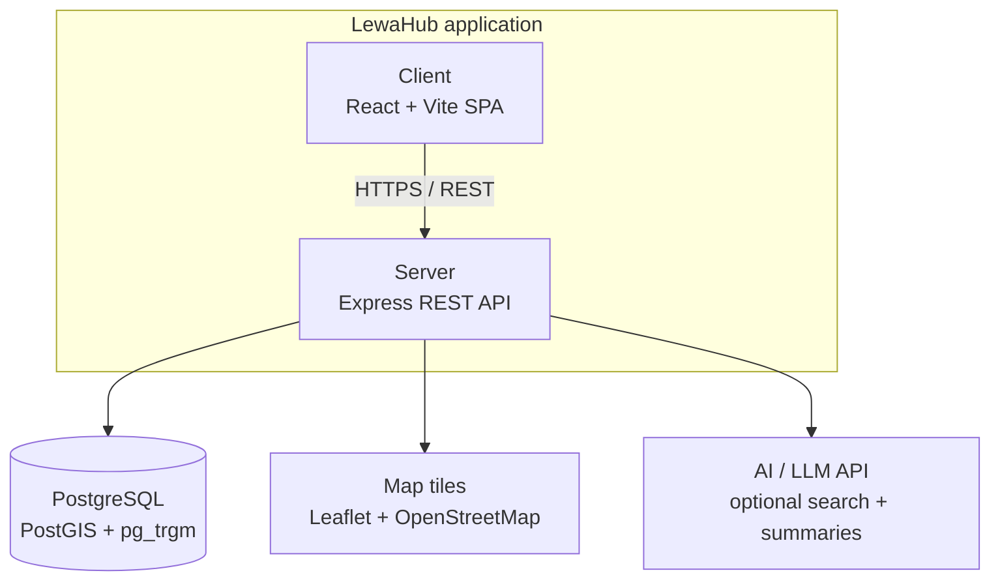

# 🎓 LewaHub

**Find the right verified school**

A school discovery platform for Cameroon — covering Primary/Nursery, Secondary, and University
schools, with location-based search, verification status, and an interactive map.


---

## 📖 Overview

LewaHub helps parents and students in Cameroon discover schools with confidence. Institutions are
searchable by region, category, and program, locatable on a map, and marked with their real
verification status (an admin/curation flag set by the LewaHub team).

The platform is a fully anonymous public site — no account required.

---

## ✨ Features

### Public Site

- 🔍 **Search & filter** : Region, Category (Primary/Nursery, Secondary, University), Language of
  instruction, Ownership, Boarding/Day, Programs, and Verified-only
- 🗺️ **Interactive map** : real institution locations for every school with coordinates
- 🏫 **Institution profiles** : description, programs & fees, location, contact info, campus photos
- ✅ **Verification status** : each school shows whether LewaHub has verified it
  (no public ratings yet — the `verified` flag is set by the team)
- 🌍 **Bilingual** : full French / English toggle across the entire site
- 📱 **Fully responsive** : mobile-first design, works on any screen size

---

## 🗂️ School Category Model

LewaHub uses exactly **3 categories**, matching the database schema:

| Category value   | Displayed as      | Notes                                                                                   |
| ---------------- | ----------------- | --------------------------------------------------------------------------------------- |
| `PrimaryNursery` | Primary / Nursery | Nursery and primary schools combined                                                    |
| `Secondary`      | Secondary         | May have `offersHighSchool: true` for schools that also run A-Level (Lower/Upper Sixth) |
| `University`     | University        | Includes colleges and technical institutes                                              |

There is no separate "High School" category — a secondary school that offers both O-Level and
A-Level is a single `Secondary` record with `offersHighSchool: true`.

---

## 🛠️ Tech Stack

| Layer    | Technology                                              |
| -------- | ------------------------------------------------------- |
| Frontend | React · Vite · TypeScript · Tailwind CSS · React Router |
| Maps     | Leaflet + OpenStreetMap                                 |
| Backend  | Node.js · Express · Zod validation                      |
| Database | PostgreSQL + PostGIS + `pg_trgm`                        |
| ORM      | Prisma                                                  |
| Cache    | Redis (optional — gracefully disabled when absent)      |
| AI       | LLM API (optional — search falls back to non-AI)        |

## Architecture

LewaHub is a **layered monolith** : one client-server application, not microservices. This was a deliberate choice; the team is small, the budget is limited, and the core data (schools, programs, locations) is tightly relational, so a single backend serving one database avoids the network overhead and operational cost that splitting into independent services would add without a corresponding benefit at this scale.



**Layers inside the backend** (routes → services → repositories) keep responsibilities separated even though everything deploys as one process:

- **Routes** : Express route handlers, one per resource (`/api/v1/schools`, `/api/v1/search`, `/api/v1/health`) with Zod query validation (`req.validatedQuery`)
- **Services** : business logic (search, caching with `X-Cache` headers, nearby-by-radius)
- **Data access** : Prisma ORM against PostgreSQL

The API is **read-only**: every public endpoint is a `GET`. There is no admin, no auth, and no
write/delete surface on the public site.

---

## 📂 Project Structure

```
LewaHub/
├── Frontend/
│   └── src/
│       ├── components/     # shared layout — Navbar, Footer, skeletons
│       ├── features/
│       │   ├── home/
│       │   ├── search/
│       │   ├── school-details/   # page-level components
│       │   ├── contact/
│       │   ├── about/
│       ├── lib/            # shared API client
│       ├── types/          # canonical shared types (SchoolDetail)
│       └── App.tsx         # route definitions
│
└── Backend/
    ├── src/
    │   ├── modules/
    │   │   ├── schools/    # list, detail, nearby (PostGIS-first)
    │   │   └── search/
    │   ├── middleware/     # rate limiting, error handling
    │   ├── lib/            # prisma client, zod validation
    │   └── config/         # env config with fail-fast validation
    ├── prisma/
    │   ├── schema.prisma
    │   └── migrations/
    └── scripts/
        └── seed.js         # idempotent sample data (51 schools)
```

---

## 🚀 Getting Started

### Prerequisites

- Node.js (v18+)
- **PostgreSQL v15+ with the PostGIS extension.** Plain PostgreSQL is not enough — `CREATE EXTENSION
  postgis;` must succeed. On Windows, install PostGIS via Stack Builder (bundled with the PostgreSQL
  installer) if it isn't already available.
- **Redis** (optional — the app detects a missing `REDIS_URL` and runs with caching disabled, so this
  can be skipped for local development if it's inconvenient to install)
- **An LLM API key provider** (optional — search falls back to non-AI behavior without one)

### 1. Clone the repo

```bash
git clone https://github.com/ChiaVoltaire07/LewaHub.git
cd LewaHub
git checkout main        # confirm you're on main, not an old feature branch
```

### 2. Set up the database

```bash
createdb lewahub
psql -d lewahub -c "CREATE EXTENSION postgis;"
psql -d lewahub -c "SELECT PostGIS_Version();"   # should return a version string
```

The `pg_trgm` extension is created automatically by the `add_search_indexes` migration —
no manual step needed.

### 3. Backend

```bash
cd Backend
npm install
cp .env.example .env
```

Open `.env` and fill in your real values:

```
PORT=4000
DATABASE_URL="postgresql://postgres:<your-password>@localhost:5432/lewahub?schema=public"
NODE_ENV="development"
FRONTEND_URL="http://localhost:5173"
CORS_ORIGINS="http://localhost:5173"
REDIS_URL="redis://localhost:6379"       # optional, leave blank if not running Redis
AI_API_KEY="sk-..."                      # optional, enables semantic search
```

> ⚠️ The backend refuses to start if `DATABASE_URL` is missing or invalid — this is
> intentional, not a bug. If it crashes with a `FATAL` message, check your `.env` values.

```bash
npx prisma migrate dev
npm run seed
npm run dev
```

Runs at `http://localhost:4000`.

### 4. Frontend

```bash
cd ../Frontend
npm install
cp .env.example .env
```

Confirm `.env` has:

```
VITE_API_BASE_URL=http://localhost:4000/api/v1
```

```bash
npm run dev
```

Runs at `http://localhost:5173`.

### 5. Tests & typecheck

```bash
# Backend — API smoke tests against the local dev database (read-only)
cd Backend && npm test

# Frontend — unit tests for the school mapping logic
cd Frontend && npm test

# Frontend — strict TypeScript check
cd Frontend && npm run typecheck
```

---

## 🔒 Security & Stability

- **Input validation**: every public endpoint validates query parameters with Zod (max `limit` 100,
  max `page` 1000000, nearby `radius` capped at 500 km); invalid input returns `400`.
- **Rate limiting**: a global 600 req / 15 min / IP limit on `/api/v1` plus a stricter
  60 req / 15 min / IP cap on `/api/v1/search`.
- **CORS locked**: only explicitly configured origins are allowed (local dev origins are excluded in
  production).
- **Security headers**: Helmet (HSTS, referrer policy, CORP).
- **Map popups** are built with DOM APIs and `textContent`, never string-concatenated HTML.
- **DB indexes**: trigram GIN indexes back ILIKE search; GIN array indexes back level/language filters.

---

## 👥 Team

Built collaboratively by a team of student developers in Cameroon.

---

## 📄 License

MIT — see [`LICENSE`](./LICENSE).
