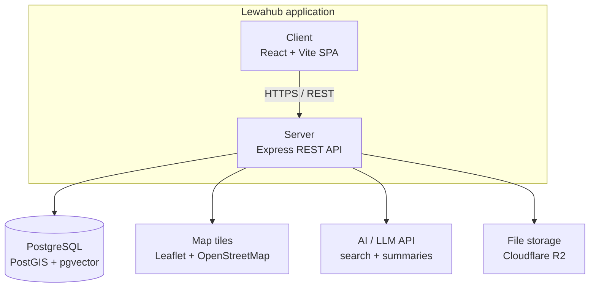

# 🎓 LewaHub

**Find the right verified school**

A school discovery platform for Cameroon — covering nursery, primary, secondary, and university-level
institutions, with location-based search, verified student ratings, and an admin panel for managing
the catalog.


---

## 📖 Overview

LewaHub helps parents and students in Cameroon discover and evaluate schools with confidence.
Schools are searchable by region, level, and program, locatable on a map, and rated by students
who have verified their enrollment . So ratings reflect real experience, not anonymous reviews.

The platform has two sides:
- **Public site** :fully anonymous browsing, no account required
- **Admin panel** :staff-only, for managing the institution catalog

---

## ✨ Features

### Public Site
- 🔍 **Search & filter** : Region, Level (Nursery/Primary/Secondary/University), Language of
  instruction, Ownership, Boarding/Day, Programs, Minimum rating
- 🗺️ **Interactive map** : real institution locations, "find near me" support
- 🏫 **Institution profiles** : description, programs, verified rating, location, contact info,
  related institutions
- ⭐ **Verified ratings** : only students who confirm enrollment (via receipt, school ID, or
  matricule) can rate a school; only the aggregate average and count are shown publicly
- 🌍 **Bilingual** : full French / English toggle across the entire site
- 📱 **Fully responsive** : mobile-first design, works on any screen size

### Admin Panel
- 🔐 Secure staff login
- 📊 Dashboard with live catalog stats
- 🏫 Full CRUD on institutions — add, edit, delete, all reflected instantly on the public site
- 🧩 Smart forms — fields adapt to the institution's level (a primary school's form looks
  different from a university's)

---

## 🛠️ Tech Stack

| Layer | Technology |
|---|---|
| Frontend | React · Vite · TypeScript · Tailwind CSS · React Router |
| Maps | Leaflet + OpenStreetMap |
| Backend | Node.js · Express · TypeScript |
| Database | PostgreSQL + PostGIS |
| ORM | Prisma |
| Caching | Redis |
| Auth | JWT + bcrypt |

## Architecture
 
Lewahub is a **layered monolith**  : one client-server application, not microservices. This was a deliberate choice; the team is small, the budget is limited, and the core data (schools, subschools, programs, evaluations) is tightly relational, so a single backend serving one database avoids the network overhead and operational cost that splitting into independent services would add without a corresponding benefit at this scale.
 

 

---

## 📂 Project Structure

```
LewaHub/
├── Frontend/
│   └── src/
│       ├── components/        # shared layout — Navbar, Footer
│       ├── features/
│       │   ├── home/
│       │   ├── search/
│       │   ├── school-details/
│       │   ├── contact/
│       │   ├── about/
│       │   └── admin/
│       ├── lib/                # shared API client
│       └── App.tsx             # route definitions
│
└── Backend/
    ├── src/
    │   ├── modules/
    │   │   ├── institutions/
    │   │   ├── programs/
    │   │   ├── geolocation/
    │   │   ├── evaluations/
    │   │   ├── search/
    │   │   └── admin/
    │   ├── middleware/
    │   ├── config/
    │   └── jobs/
    └── prisma/
        ├── schema.prisma
        └── seed.ts
```

---

## 🚀 Getting Started

### Prerequisites
- Node.js (v18+)
- PostgreSQL with the PostGIS extension
- Redis

### 1. Clone the repo
```bash
git clone https://github.com/ChiaVoltaire07/LewaHub.git
cd LewaHub
```

### 2. Set up the database
```sql
CREATE DATABASE lewahub;
\c lewahub
CREATE EXTENSION postgis;
```

### 3. Backend
```bash
cd Backend
npm install
cp .env.example .env   # then fill in DATABASE_URL, REDIS_URL, JWT_SECRET
npx prisma migrate dev
npm run seed
npm run dev
```
Runs at `http://localhost:4000`.

### 4. Frontend
```bash
cd Frontend
npm install
echo "VITE_API_BASE_URL=http://localhost:4000/api/v1" > .env
npm run dev
```
Runs at `http://localhost:5173`.

### 5. Admin access
Visit `/admin/login` using the admin account created by the seed script.

---


## 🔒 Security

- All admin write operations require a valid JWT
- Passwords hashed with bcrypt
- Student verification references are hashed, never stored raw
- Input validation on every write endpoint
- Rate limiting on public and auth endpoints

---

## 👥 Team

Built collaboratively by a team of student developers in Cameroon.

---

## 📄 License

This project is currently unlicensed / for academic use. Add a license file if you plan to open-source it.
